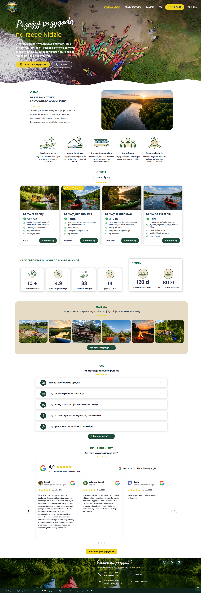
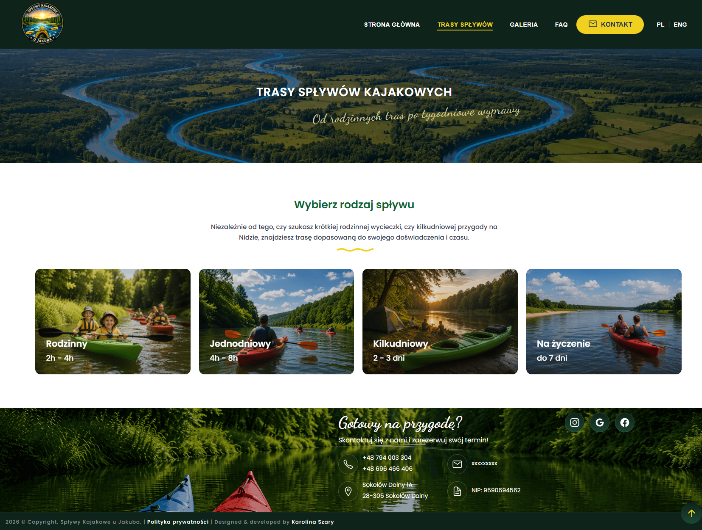
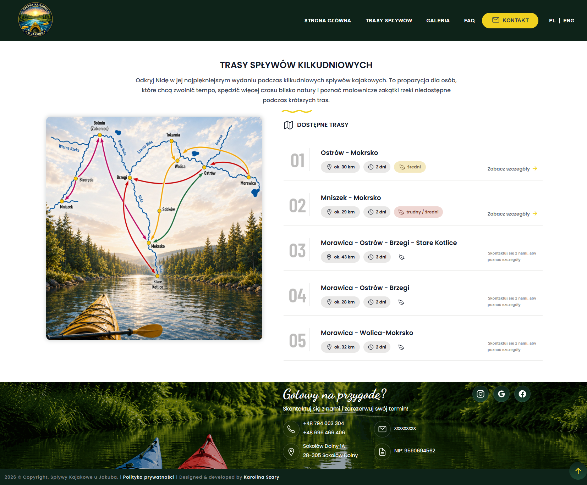
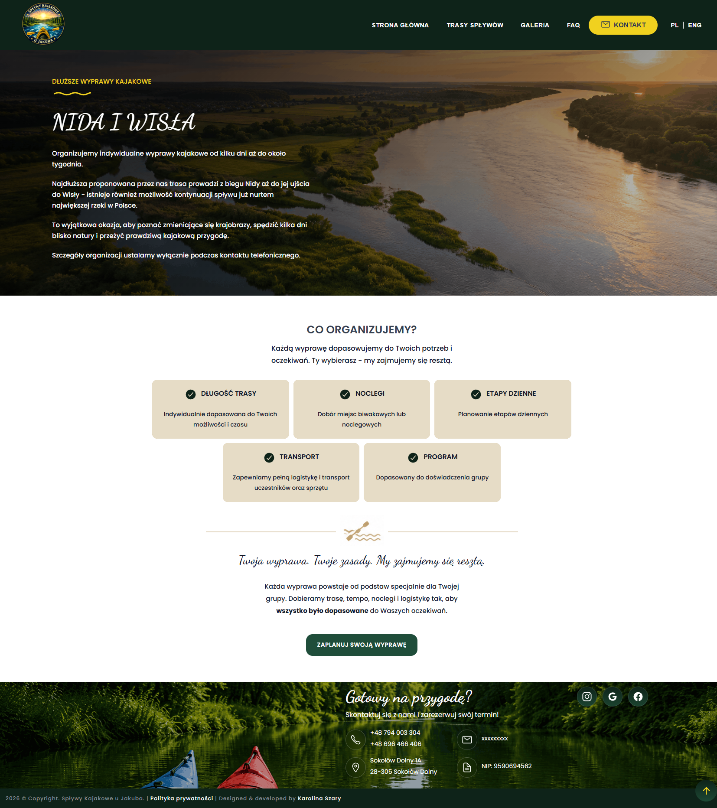
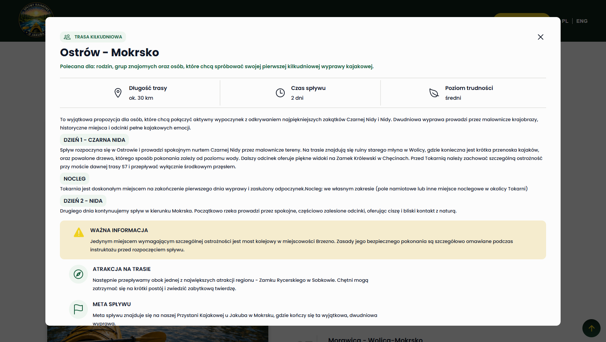
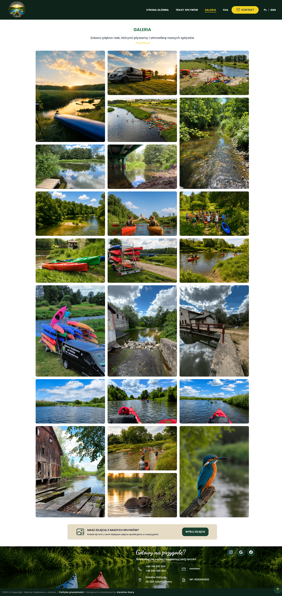
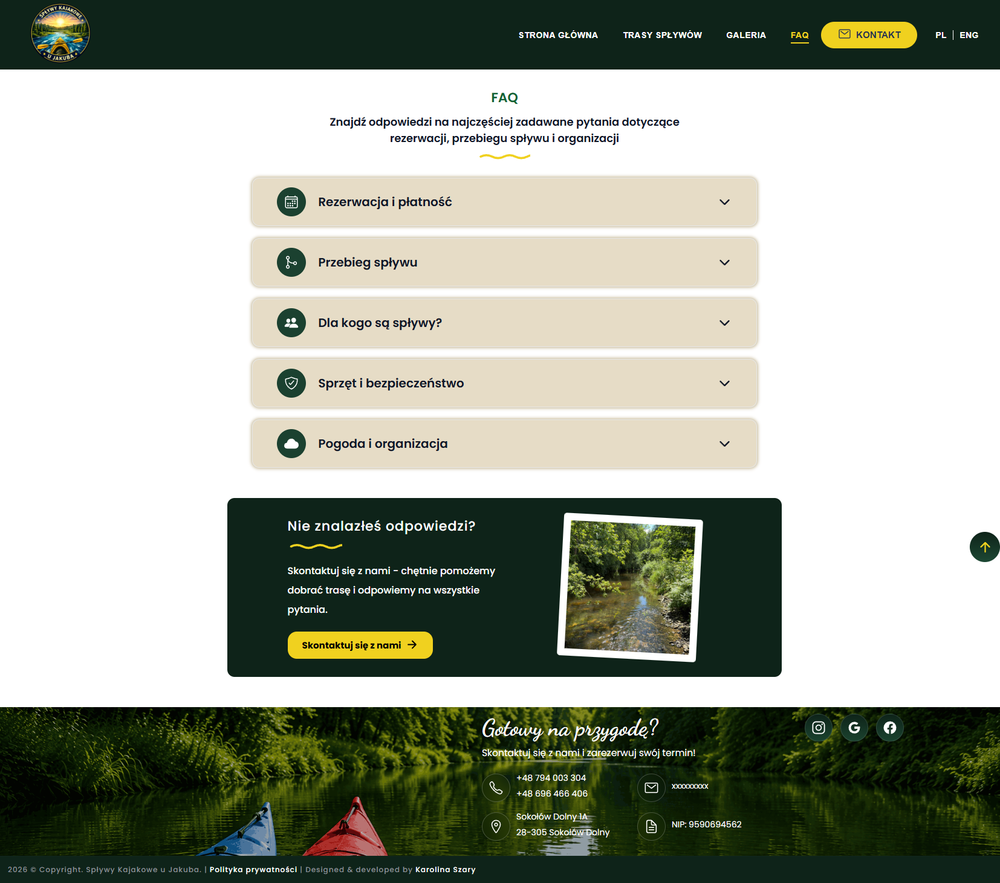
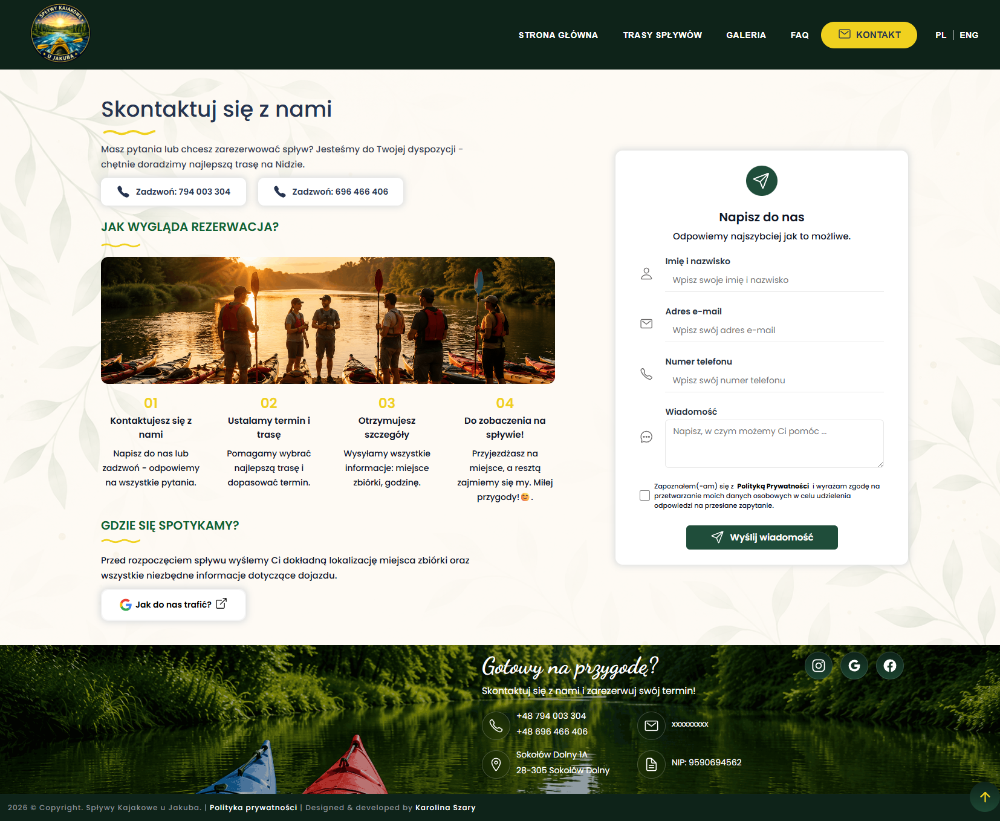
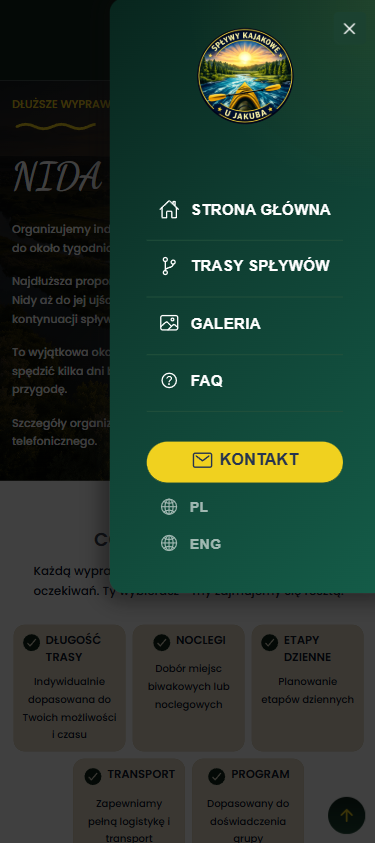

# Kayaking Trips Website

A responsive web application developed for a kayaking company offering a variety of canoe trips on the Nida River in Poland.

The project was created from scratch based on the client's business requirements. After gathering information during the initial consultation, I designed the website structure and user interface, then implemented the complete frontend using React.

The application was built with a reusable component architecture, making it easy to manage content, add new routes and maintain the project as it grows.

---

**Project Status:** The frontend is functionally complete. The remaining work includes bilingual support (Polish / English), backend integration for the contact form and production deployment.

**Live Demo:** https://kayaking-trips-eight.vercel.app/

## Preview

### Home Page

### Routes Page

### MultidayTrips Page

### OnRequestTrips Page

### Trip Details

### Gallery Page

### Faq Page

### Contact Page

### Mobile Nav

---

## My Responsibilities

I was responsible for the complete frontend implementation of the website, including:

- Gathering business requirements during the initial client meeting
- Designing the website layout and user interface
- Planning the application architecture
- Building reusable React components
- Implementing client-side routing with React Router
- Managing shared navigation state with Context API and a custom hook
- Developing responsive layouts for desktop, tablet and mobile devices
- Creating interactive UI elements, including galleries, modals and navigation
- Creating smooth page and component animations using Motion
- Styling the application using CSS

---

## Key Features

- Responsive multi-page React application
- Family, one-day, multi-day and custom trip presentations
- Interactive kayaking route cards with detailed modal windows
- Image gallery with Lightbox preview, zoom, thumbnails and image counter
- Responsive Google Reviews carousel with navigation controls and pagination
- Responsive desktop navigation and animated mobile menu with scroll locking
- Contact form with frontend validation and required privacy consent
- Smooth UI animations using Motion
- Optimized images for improved loading performance
- Privacy Policy page

---

## Challenges & Solutions

### Designing without a ready-made design

The client provided business information, photos and descriptions, but no visual design. I planned the page structure and designed the entire frontend from scratch to create a modern and user-friendly experience.

### Managing different route types

Each kayaking route contains different information such as duration, distance, difficulty level, attractions, warnings and multi-day descriptions. I designed a reusable data structure and component architecture capable of rendering different route variants without duplicating code.

### Building reusable React components

Instead of creating separate components for each route, I built reusable components driven by data. This makes the application easier to maintain and allows new routes to be added with minimal code changes.

### Creating a responsive user interface

The interface was designed to work consistently across desktop, tablet and mobile devices, including dedicated mobile navigation and layouts optimized for different screen sizes.

---

## What I Learned

This project helped me strengthen my frontend development skills by:

- Translating business requirements into a complete React application
- Designing a reusable and scalable component architecture
- Managing application state with Context API
- Working with React Router
- Building reusable UI components driven by data
- Organizing and structuring larger React projects
- Improving responsive design techniques
- Integrating third-party React libraries
- Strengthening my debugging and problem-solving skills while working on a real client project

---

## Tech Stack

### Frontend

- React
- JavaScript (ES6+)
- CSS3

### Styling & Responsive Design

- Flexbox
- CSS Grid
- Media Queries

### Routing

- React Router

### State Management

- Context API

### Animations

- Motion

### UI Components & Libraries

- Embla Carousel
- Yet Another React Lightbox

### Version Control

- Git
- GitHub

### Deployment

- Vercel

## React Concepts Applied

- Functional Components
- useState
- useEffect
- Context API
- Custom Context Hook
- Props
- Component Composition
- Conditional Rendering
- Dynamic Rendering with Array.map()
- Client-side Routing
- React Portals

---

## Future Improvements

- Add Polish / English language switch
- Integrate the contact form with a backend service
- Deploy the production version

---

## Author

Designed and developed by Karolina Szary
